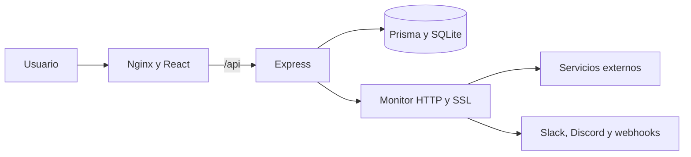

# DevDash

[](https://vps26527.cubepath.net)
[](https://github.com/CubePathInc/cubethon-2026-Q3)
[](#-despliegue)
[](deploy/LICENSE)

DevDash es una plataforma self-hosted para monitorear disponibilidad, latencia,
certificados SSL, incidentes y recursos de infraestructura desde una interfaz
completamente en español.

[**Abrir DevDash en producción**](https://vps26527.cubepath.net) ·
[**Consultar el estado público**](https://vps26527.cubepath.net/status)

> [!IMPORTANT]
> DevDash participa en **Cubethon 2026 Q3** y está desplegado y funcionando en
> un VPS de **CubePath**.

## 🚀 ¿Por qué DevDash?

- Centraliza monitoreo, incidentes, diagnóstico y estado público.
- Utiliza comprobaciones HTTP, SSL y recursos reales del servidor.
- Conserva métricas e historial dentro de la infraestructura del usuario.
- Ofrece una experiencia clara y completamente en español.
- Se despliega de forma reproducible mediante Docker Compose.

## 📋 Características

- Monitoreo HTTP y HTTPS con intervalos configurables.
- Disponibilidad, latencia e historial visual.
- Verificación y alertas de certificados SSL.
- Registro automático de incidentes y exportación CSV.
- Página pública `/status` sin autenticación.
- Acceso de demostración con un clic y permisos estrictos de solo lectura.
- Pausa, reanudación, etiquetas y visibilidad por servicio.
- Alertas opcionales para Slack, Discord y webhooks.
- Diagnóstico de CPU, memoria, disco y tiempo activo.
- Terminal interactiva para consultas y comprobaciones manuales.

## 📦 Inicio rápido

### Requisitos

- Node.js 22 y pnpm 11.15.1.
- Docker Engine 24 o superior.
- Docker Compose v2.

### Desarrollo local

```bash
cp backend/.env.example backend/.env

cd backend
pnpm install
pnpm exec prisma generate
pnpm exec prisma migrate deploy
pnpm dev
```

En otra terminal:

```bash
cd frontend
pnpm install
pnpm dev
```

- Panel: `http://localhost:5173`
- Estado público: `http://localhost:5173/status`
- API: `http://localhost:3001/health`

## ☁️ Despliegue

Configura `backend/.env` con valores de producción:

```env
NODE_ENV=production
PORT=3001
DATABASE_URL=file:/data/devdash.db
JWT_SECRET=una-clave-aleatoria-de-al-menos-32-caracteres
ADMIN_USERNAME=admin
ADMIN_PASSWORD=una-contrasena-segura-de-al-menos-12-caracteres
DEMO_MODE_ENABLED=true
DEMO_USERNAME=demo
CORS_ORIGINS=https://vps26527.cubepath.net
PUBLIC_APP_URL=https://vps26527.cubepath.net
TRUST_PROXY=1
SESSION_TTL_MINUTES=480
ALLOW_PRIVATE_TARGETS=false
INSTANCE_NAME=DevDash
INSTANCE_REGION=CubePath
```

Construye y arranca la aplicación:

```bash
cp deploy/.env.example deploy/.env
docker compose -f deploy/docker-compose.yml up -d --build
docker compose -f deploy/docker-compose.yml ps
curl http://localhost/health
```

> [!WARNING]
> Genera los secretos directamente en el VPS, utiliza HTTPS y no expongas el
> puerto 3001 a Internet.

## 🧱 Arquitectura



- **Frontend:** React 19, TypeScript, Vite, Tailwind CSS, SWR y Recharts.
- **Backend:** Node.js, Express, TypeScript, Prisma y SQLite.
- **Infraestructura:** Docker, Docker Compose, Nginx y CubePath.

## 🔐 Seguridad

- Sesiones mediante cookies `HttpOnly`, `Secure` y `SameSite=Strict`.
- Contraseñas almacenadas con bcrypt.
- Usuarios identificados mediante UUID y autorización por roles.
- Modo demostración protegido en el backend contra operaciones de escritura.
- CORS y protección contra CSRF.
- Límites de solicitudes e intentos de acceso.
- Protección SSRF y bloqueo de redes privadas.
- CSP, HSTS y contenedores ejecutados sin privilegios.

## 🧪 Validación

```bash
cd backend && pnpm test && pnpm exec prisma validate
cd ../frontend && pnpm lint && pnpm build
cd .. && docker compose -f deploy/docker-compose.yml config
```

## 🏆 Cubethon 2026 Q3

DevDash responde a los criterios del concurso:

- **Utilidad:** monitoreo y comunicación pública en un solo producto.
- **Originalidad:** combina estado de servicios y diagnóstico real del VPS.
- **Implementación:** aplicación tipada, persistente, probada y protegida.
- **Presentación:** panel visual, terminal e historial de incidentes.
- **CubePath:** monitoreo continuo y persistencia dentro de un VPS de CubePath.

Consulta el [guion de demostración](deploy/docs/DEMO_SCRIPT.md) y la
[lista de entrega](deploy/docs/SUBMISSION.md).

## 📄 Licencia

Creado por [GonzaDev](https://github.com/GanzytoX) para **Cubethon 2026 Q3** y
distribuido bajo la [licencia MIT](deploy/LICENSE).

---

**[DevDash está alojado en CubePath](https://vps26527.cubepath.net).**
