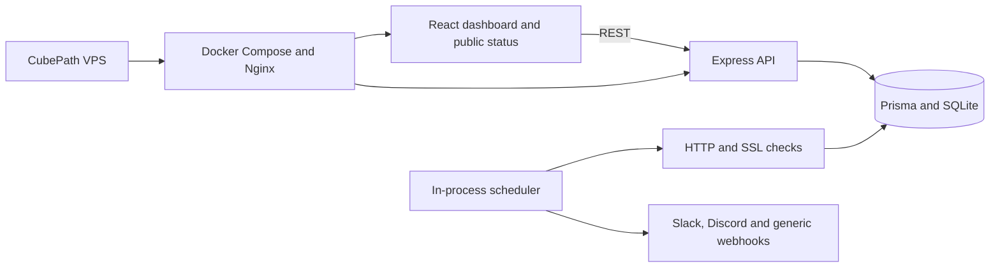

# DevDash

> Lightweight, self-hosted uptime monitoring and public status pages — hosted on [CubePath](https://cubepath.com).

DevDash monitors HTTP services, latency, SSL expiration, incidents and the health of the VPS that runs it. It is designed to provide a useful monitoring stack on one small server with SQLite persistence.

## Cubethon 2026 Q3

DevDash was built for Cubethon 2026 Q3. It runs natively on CubePath and visibly demonstrates the host through real CPU, memory, disk and uptime diagnostics.

## Features

- Real HTTP/HTTPS checks with configurable intervals.
- SSL expiration monitoring.
- Incident start, recovery and duration tracking.
- Public, shareable `/status` page.
- Slack, Discord and generic webhook alerts.
- 24-hour, 7-day and 30-day status periods.
- CSV incident export.
- Search, filters, tags and public visibility controls.
- JWT authentication, rate limiting, CORS allowlist and SSRF protection.
- Real CubePath VPS diagnostics.
- Automated retention and SQLite backups.
- Responsive dark/light interface.

## Architecture



## Local development

Requirements: Node.js 22+, pnpm 11+ and SQLite.

```bash
cp backend/.env.example backend/.env
# Set JWT_SECRET, ADMIN_USERNAME and ADMIN_PASSWORD.
cd backend && pnpm install && pnpm prisma:deploy && pnpm dev
cd frontend && pnpm install && pnpm dev
```

For an existing database, rotate or create the administrator after setting the two admin variables:

```bash
cd backend && pnpm admin:reset
```

The dashboard defaults to `http://localhost:5173`; the API defaults to `http://localhost:3001`.

## CubePath deployment

1. Create a CubePath VPS and point a domain to it.
2. Install Docker Engine and the Compose plugin.
3. Clone this repository and copy `backend/.env.example` to `backend/.env`.
4. Set production secrets, `CORS_ORIGINS`, `PUBLIC_APP_URL`, instance name and region.
5. Run `docker compose up -d --build`.
6. Put the stack behind CubePath's HTTPS/reverse-proxy setup or a TLS-enabled proxy such as Caddy.
7. Schedule `deploy/backup-sqlite.sh` daily with cron.
8. Verify `/health`, `/status`, reboot recovery and webhook delivery.

For private-network monitoring, explicitly set `ALLOW_PRIVATE_TARGETS=true`. Keep it disabled on public demos.

## Production checklist

- [ ] Strong 32+ character JWT secret.
- [ ] Strong administrator password, removed from the environment after initial seeding when appropriate.
- [ ] HTTPS enabled.
- [ ] CORS restricted to the real public origin.
- [ ] Database volume backed up.
- [ ] DevDash monitors its own public `/health` endpoint.
- [ ] Public status page contains only safe public services.
- [ ] Demo tested from a private browser and another network.

## Verification

```bash
cd backend && pnpm test && pnpm prisma validate
cd frontend && pnpm lint && pnpm build
```

## Security

Monitoring arbitrary URLs can create SSRF risk. DevDash resolves targets and blocks loopback, private, link-local and metadata networks unless the operator explicitly opts in. Report security issues privately to the repository owner.

## License

MIT
