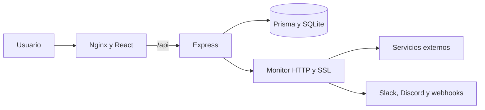

# DevDash

DevDash es una plataforma self-hosted para monitorear disponibilidad, latencia,
certificados SSL, incidentes y recursos de infraestructura desde una interfaz
completamente en español.

[**Abrir DevDash en producción**](https://vps26527.cubepath.net) ·
[**Consultar el estado público**](https://vps26527.cubepath.net/status)

> [!IMPORTANT]
> DevDash participa en **Cubethon 2026 Q3** y está desplegado y funcionando en
> un VPS de **CubePath**.

## 🚀 ¿Por qué DevDash?

- Centraliza monitoreo, incidentes, diagnóstico y estado público.
- Utiliza comprobaciones HTTP, SSL y recursos reales del servidor.
- Conserva métricas e historial dentro de la infraestructura del usuario.
- Ofrece una experiencia clara y completamente en español.
- Funciona en producción dentro de la infraestructura de CubePath.

## 📋 Características

- Monitoreo HTTP y HTTPS con intervalos configurables.
- Disponibilidad, latencia e historial visual.
- Verificación y alertas de certificados SSL.
- Registro automático de incidentes y exportación CSV.
- Página pública `/status` sin autenticación.
- Acceso de demostración con un clic y permisos estrictos de solo lectura.
- Pausa, reanudación, etiquetas y visibilidad por servicio.
- Alertas opcionales para Slack, Discord y webhooks.
- Diagnóstico de CPU, memoria, disco y tiempo activo.
- Terminal interactiva para consultas y comprobaciones manuales.

## 🌐 Probar en producción

1. Abre [DevDash en CubePath](https://vps26527.cubepath.net).
2. Selecciona **Probar demo** para entrar con acceso seguro de solo lectura.
3. Consulta la [página de estado público](https://vps26527.cubepath.net/status)
   sin iniciar sesión.

## 🧱 Arquitectura

- **Frontend:** React 19, TypeScript, Vite, Tailwind CSS, SWR y Recharts.
- **Backend:** Node.js, Express, TypeScript, Prisma y SQLite.
- **Infraestructura:** Docker, Docker Compose, Nginx y CubePath.

## 🔐 Seguridad

- Sesiones mediante cookies `HttpOnly`, `Secure` y `SameSite=Strict`.
- Contraseñas almacenadas con bcrypt.
- Usuarios identificados mediante UUID y autorización por roles.
- Modo demostración protegido en el backend contra operaciones de escritura.
- CORS y protección contra CSRF.
- Límites de solicitudes e intentos de acceso.
- Protección SSRF y bloqueo de redes privadas.
- CSP, HSTS y contenedores ejecutados sin privilegios.

## 📄 Licencia

Creado por [GonzaDev](https://github.com/GanzytoX) para **Cubethon 2026 Q3** y
distribuido bajo la [licencia MIT](deploy/LICENSE).

---

**[DevDash está alojado en CubePath](https://vps26527.cubepath.net).**
