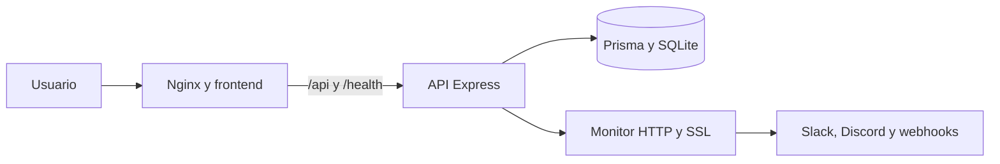

# DevDash — despliegue en CubePath

DevDash es un monitor autohospedado de disponibilidad, latencia, certificados
SSL e incidentes. Este directorio contiene todo lo necesario para construir y
ejecutar el frontend y el backend en un VPS de CubePath.

## Arquitectura



## Requisitos

- Docker Engine 24 o superior.
- Docker Compose v2.
- Un dominio apuntando al VPS.
- HTTPS mediante el proxy de CubePath, Caddy o el proxy inverso elegido.

## Configuración

Desde la raíz del repositorio:

```bash
cp backend/.env.example backend/.env
cp deploy/.env.example deploy/.env
```

Edita `backend/.env` y configura al menos:

```env
NODE_ENV=production
JWT_SECRET=una-clave-aleatoria-de-al-menos-32-caracteres
ADMIN_USERNAME=admin
ADMIN_PASSWORD=una-contrasena-segura-de-al-menos-12-caracteres
CORS_ORIGINS=https://estado.tudominio.com
PUBLIC_APP_URL=https://estado.tudominio.com
DATABASE_URL=file:/data/devdash.db
TRUST_PROXY=1
SESSION_TTL_MINUTES=480
```

Genera los secretos en el propio servidor y no los confirmes en Git. Por
ejemplo:

```bash
openssl rand -hex 32
```

En producción, `PUBLIC_APP_URL` debe usar HTTPS. Publica únicamente el proxy
frontal (80/443), mantén el puerto 3001 cerrado y limita SSH a las direcciones
de administración. Cambia las credenciales iniciales después del primer
acceso y deja `ALLOW_PRIVATE_TARGETS=false` para impedir solicitudes a redes
internas y al servicio de metadatos del VPS.

## Construcción y arranque

```bash
docker compose -f deploy/docker-compose.yml up -d --build
docker compose -f deploy/docker-compose.yml ps
curl http://localhost/health
```

La aplicación queda disponible en el puerto configurado mediante `APP_PORT`
(80 por defecto). El backend no se publica directamente; Nginx reenvía
`/api/*` y `/health` dentro de la red privada de Compose.

## Operación

```bash
# Ver logs
docker compose -f deploy/docker-compose.yml logs -f

# Actualizar
git pull
docker compose -f deploy/docker-compose.yml up -d --build

# Detener
docker compose -f deploy/docker-compose.yml down

# Reiniciar sin borrar SQLite
docker compose -f deploy/docker-compose.yml restart
```

## Respaldos

Instala `sqlite3` en el VPS y programa:

```bash
chmod +x deploy/backup-sqlite.sh
0 3 * * * /ruta/devdash/deploy/backup-sqlite.sh
```

El volumen `devdash_data` no se elimina con `docker compose down`. No utilices
`docker compose down -v` en producción salvo que quieras borrar los datos.
Los respaldos se crean con permisos `0600`; almacénalos cifrados fuera del VPS
y comprueba periódicamente que puedan restaurarse.

## Endurecimiento recomendado del VPS

- Activa actualizaciones de seguridad automáticas y un firewall con 22, 80 y
  443 como únicos puertos públicos necesarios.
- Termina TLS con un certificado válido y redirige HTTP a HTTPS antes de
  exponer la aplicación.
- Ejecuta Docker en modo rootless cuando la imagen del VPS lo permita.
- No montes el socket de Docker ni carpetas del host dentro de los
  contenedores de DevDash.
- Revisa los registros, renueva secretos ante cualquier exposición y conserva
  respaldos cifrados con una política de rotación.

## Verificación previa a la entrega

```bash
cd backend && pnpm test && pnpm exec prisma validate
cd ../frontend && pnpm lint && pnpm build
cd .. && docker compose -f deploy/docker-compose.yml config
```

Comprueba además `/health`, `/status`, el reinicio del VPS, el certificado TLS
y la entrega real de alertas. En las herramientas del navegador, verifica que
la cookie de sesión sea `HttpOnly`, `SameSite=Strict` y `Secure`, y que ninguna
credencial o token aparezca en `localStorage` o `sessionStorage`.
