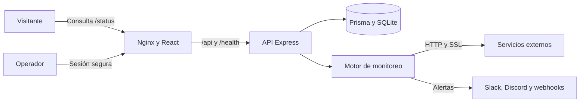

# DevDash

[](https://cubepath.com)
[](https://github.com/CubePathInc/cubethon-2026-Q3)
[](#-despliegue-en-cubepath)
[](LICENSE)

DevDash es una plataforma self-hosted para supervisar disponibilidad, latencia,
certificados SSL, incidentes y recursos de infraestructura desde una interfaz
completamente en español. Centraliza el estado técnico y la comunicación
pública de tus servicios sin enviar el historial operativo a terceros.

Consulta el [inicio rápido](#-instalación), el
[despliegue en CubePath](#-despliegue-en-cubepath) o el
[guion de demostración](docs/DEMO_SCRIPT.md).

> [!IMPORTANT]
> DevDash participa en **Cubethon 2026 Q3**. La aplicación está preparada para
> ejecutarse en un VPS de **CubePath**, muestra la leyenda «Alojado en CubePath»
> y debe permanecer desplegada durante la evaluación.

## 🚀 ¿Por qué DevDash?

- 🎯 **Útil:** reúne monitoreo, incidentes, diagnóstico y estado público en un
  solo lugar.
- 🔐 **Privado:** conserva servicios, métricas e historial dentro de tu propio
  VPS.
- 📡 **Real:** obtiene sus métricas mediante comprobaciones HTTP, SSL y recursos
  reales del servidor; no utiliza datos simulados.
- 🌎 **En español:** presenta estados técnicos con etiquetas claras para el
  operador y sus usuarios.
- 🧩 **Integrado:** admite Slack, Discord y webhooks genéricos sin depender de
  una plataforma de monitoreo externa.
- 🐳 **Reproducible:** se construye y despliega con Docker Compose.
- ☁️ **Preparado para CubePath:** aprovecha un VPS para ejecutar monitoreo
  continuo, persistir historial y publicar una página de estado.

## 📦 Instalación

### Inicio rápido con Docker

Desde la raíz del repositorio:

```bash
cp backend/.env.example backend/.env
cp deploy/.env.example deploy/.env

# Edita backend/.env antes de continuar
docker compose -f deploy/docker-compose.yml up -d --build
docker compose -f deploy/docker-compose.yml ps
curl http://localhost/health
```

La aplicación queda disponible en `APP_PORT`, puerto 80 por defecto. El backend
permanece dentro de la red privada de Docker y Nginx publica el frontend,
`/api/*` y `/health`.

### Desarrollo local

#### Backend

```bash
cd backend
pnpm install
pnpm exec prisma generate
pnpm exec prisma migrate deploy
pnpm dev
```

#### Frontend

```bash
cd frontend
pnpm install
pnpm dev
```

#### Direcciones locales

- Panel del operador: `http://localhost:5173`
- Estado público: `http://localhost:5173/status`
- Salud de la API: `http://localhost:3001/health`

## 📋 Características principales

### Monitoreo y rendimiento

- Comprobaciones HTTP y HTTPS con intervalos configurables.
- Estado en línea, degradado, fuera de línea o pausado.
- Latencia actual, promedio e historial visual.
- Disponibilidad calculada a partir de comprobaciones persistidas.
- Comprobación manual desde el panel o la terminal interactiva.

### Certificados e incidentes

- Verificación del certificado SSL y sus días restantes.
- Alertas de certificados próximos a vencer, vencidos o no confiables.
- Apertura y resolución automática de incidentes.
- Duración, cronología y estado de cada interrupción.
- Exportación CSV compatible con Excel y protegida contra fórmulas maliciosas.

### Operación

- Alta, edición, pausa, reanudación y eliminación de servicios.
- Etiquetas y control de visibilidad pública.
- Diagnóstico real de CPU, memoria, disco y tiempo activo.
- Consola de comandos para consultar servicios y ejecutar diagnósticos.
- Persistencia SQLite administrada con Prisma.

### Estado público e integraciones

- Página `/status` accesible sin autenticación.
- Periodos de 24 horas, 7 días y 30 días.
- Resumen de disponibilidad, latencia, SSL e incidentes recientes.
- Alertas opcionales para Slack, Discord y webhooks genéricos.
- Identificación visible de CubePath dentro del producto.

## 🔐 Seguridad

DevDash aplica controles defensivos en toda la plataforma:

- Cookies de sesión `HttpOnly`, `Secure` y `SameSite=Strict`.
- Contraseñas almacenadas con bcrypt.
- JWT restringidos por algoritmo, emisor, audiencia y vencimiento.
- CORS limitado a orígenes autorizados y protección contra CSRF.
- Límites para intentos de inicio de sesión y rutas públicas.
- Validación contra SSRF, redes privadas y endpoints de metadatos.
- CSP, HSTS y cabeceras defensivas desde Nginx.
- Contenedores no privilegiados, sin capacidades Linux y con raíz de solo
  lectura.
- Límites de solicitudes, procesos, registros y tiempos de conexión.

En producción también debes usar HTTPS, restringir SSH, mantener actualizado el
VPS y almacenar respaldos cifrados fuera del servidor.

## 🚀 Primeros pasos

### 1. Configura el entorno

Genera un secreto local:

```bash
openssl rand -hex 32
```

Configura `backend/.env`:

```env
NODE_ENV=development
PORT=3001
DATABASE_URL=file:./devdash.db
JWT_SECRET=pega-aqui-el-resultado-de-openssl
ADMIN_USERNAME=admin
ADMIN_PASSWORD=utiliza-una-contrasena-segura
CORS_ORIGINS=http://localhost:5173
PUBLIC_APP_URL=http://localhost:5173
TRUST_PROXY=0
SESSION_TTL_MINUTES=480
ALLOW_PRIVATE_TARGETS=false
```

### 2. Inicia sesión

Abre el panel y utiliza las credenciales administrativas configuradas. La
sesión se mantiene mediante una cookie protegida y no se guarda en
`localStorage` ni `sessionStorage`.

### 3. Registra un servicio

Indica:

- Nombre del servicio.
- URL HTTP o HTTPS.
- Método `GET`, `POST` o `HEAD`.
- Intervalo de comprobación.
- Etiquetas.
- Visibilidad en la página pública.

### 4. Consulta y comparte el estado

El panel administrativo muestra métricas, incidentes y recursos del host. La
ruta `/status` ofrece una vista pública limitada a los servicios que el
operador decida compartir.

## 🧱 Arquitectura



### Tecnologías

- **Frontend:** React 19, TypeScript, Vite, Tailwind CSS, SWR y Recharts.
- **Backend:** Node.js, Express, TypeScript, Prisma y SQLite.
- **Infraestructura:** Docker, Docker Compose y Nginx.
- **Alojamiento:** VPS de CubePath.

### Estructura

```text
devdash/
├── backend/   # API, monitoreo, persistencia, validaciones y pruebas
├── frontend/  # Panel administrativo y página pública
└── deploy/    # Dockerfiles, Compose, Nginx y documentación
```

## ☁️ Despliegue en CubePath

### Requisitos

- VPS de CubePath.
- Docker Engine 24 o superior.
- Docker Compose v2.
- Dominio apuntando al VPS.
- HTTPS mediante CubePath, Caddy o el proxy inverso elegido.
- `sqlite3` para ejecutar respaldos desde el host.

### Configuración de producción

```env
NODE_ENV=production
PORT=3001
DATABASE_URL=file:/data/devdash.db
JWT_SECRET=una-clave-aleatoria-de-al-menos-32-caracteres
ADMIN_USERNAME=admin
ADMIN_PASSWORD=una-contrasena-segura-de-al-menos-12-caracteres
CORS_ORIGINS=https://estado.tudominio.com
PUBLIC_APP_URL=https://estado.tudominio.com
TRUST_PROXY=1
SESSION_TTL_MINUTES=480
ALLOW_PRIVATE_TARGETS=false
INSTANCE_NAME=DevDash
INSTANCE_REGION=CubePath
```

> [!WARNING]
> Genera los secretos directamente en el VPS, no los confirmes en Git, utiliza
> HTTPS y mantén el puerto 3001 cerrado a Internet.

### Operación

```bash
# Consultar registros
docker compose -f deploy/docker-compose.yml logs -f

# Actualizar
git pull
docker compose -f deploy/docker-compose.yml up -d --build

# Reiniciar sin eliminar SQLite
docker compose -f deploy/docker-compose.yml restart

# Detener
docker compose -f deploy/docker-compose.yml down
```

No utilices `docker compose down -v` en producción: elimina el volumen
persistente `devdash_data`.

### Respaldos

```bash
chmod +x deploy/backup-sqlite.sh
0 3 * * * /ruta/devdash/deploy/backup-sqlite.sh
```

El script crea copias consistentes de SQLite con permisos `0600` y elimina los
respaldos anteriores al periodo de retención.

## 🧪 Validación

### Backend

```bash
cd backend
pnpm test
pnpm exec prisma validate
pnpm audit --prod
```

### Frontend

```bash
cd frontend
pnpm lint
pnpm build
pnpm audit --prod
```

### Contenedores

```bash
docker compose -f deploy/docker-compose.yml config
docker compose -f deploy/docker-compose.yml up -d --build
docker compose -f deploy/docker-compose.yml ps
```

Las pruebas cubren validación de servicios, protección de destinos de red,
seguridad de cookies y neutralización de fórmulas en exportaciones CSV.

## 🎬 Demostración

Flujo sugerido para presentar DevDash:

1. Abre `/status` y muestra la página pública alojada en CubePath.
2. Inicia sesión en el panel.
3. Registra un servicio real.
4. Muestra disponibilidad, latencia, SSL y etiquetas.
5. Pausa o reanuda el monitoreo.
6. Provoca y resuelve un incidente controlado.
7. Exporta el historial de incidentes.
8. Ejecuta `status` desde la terminal para mostrar el VPS de CubePath.

Consulta el [guion completo](docs/DEMO_SCRIPT.md).

## 🏆 Cubethon 2026 Q3

DevDash está diseñado para responder directamente a los criterios del evento:

- **Utilidad:** resuelve monitoreo, diagnóstico y comunicación pública desde un
  solo producto.
- **Originalidad:** combina estado de servicios y salud real del VPS en una
  experiencia en español.
- **Calidad:** utiliza una arquitectura full stack tipada, persistencia,
  pruebas automatizadas y controles de seguridad.
- **Presentación:** ofrece panel visual, terminal interactiva, métricas e
  historial de incidentes.
- **CubePath:** ejecuta monitoreo continuo, persistencia y diagnóstico dentro de
  un VPS de CubePath.

Antes de entregar, completa la [lista de verificación](docs/SUBMISSION.md) y
confirma que la aplicación siga disponible públicamente.

## 📚 Documentación

### Uso y presentación

- [Guion de demostración](docs/DEMO_SCRIPT.md)
- [Lista de entrega para Cubethon](docs/SUBMISSION.md)
- Página pública de estado: `/status`
- Endpoint de salud: `/health`

### Operación

- [Configuración de ejemplo del backend](../backend/.env.example)
- [Docker Compose](docker-compose.yml)
- [Configuración de Nginx](nginx.conf)
- [Script de respaldos](backup-sqlite.sh)

## 📖 Recursos

- [CubePath](https://cubepath.com)
- [Cubethon 2026 Q3](https://github.com/CubePathInc/cubethon-2026-Q3)
- [Repositorio de DevDash](https://github.com/GanzytoX/devdash)
- [Perfil de GonzaDev](https://github.com/GanzytoX)

## 📄 Legal

- Licencia: [MIT](LICENSE)
- Autor: [GonzaDev](https://github.com/GanzytoX)
- Alojamiento: [CubePath](https://cubepath.com)

---

Construido por **GonzaDev** para **Cubethon 2026 Q3** y alojado en
**[CubePath](https://cubepath.com)**.
